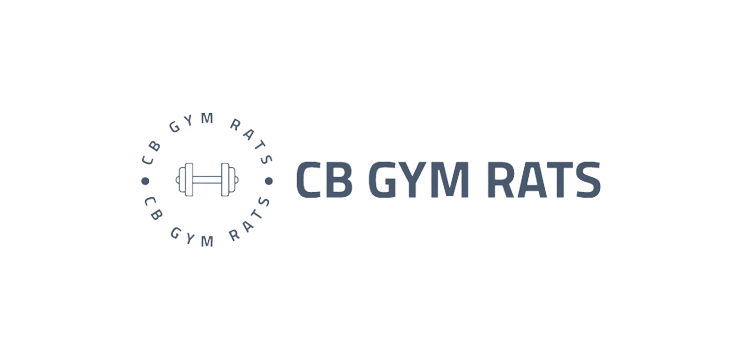

 
  
  <h1>📄 Description </h1>
  CB Gym Rats is a team made up from 4 team members. The goal of the team is to create a game based on correct writing and mathematical calculations.
  <h1>🧑‍🤝‍🧑 Our Team </h1>
  

  
1. **Yanislav Yanev** - **Scrum trainer**	
   > ***GitHub profile***: [***KGGeorgiev21***](https://github.com/KGGeorgiev21)	

2. **Ivailo Bachvarov** - **Backend Developer** 
   > ***GitHub profile***: [***ISBachvarov21***](https://github.com/ISBachvarov21)	

3. **Georgi Filipov** - **Frontend Developer** 
   > ***GitHub profile***: [***GYFilipov21***](https://github.com/GYFilipov21)	

4. **Simeon Syarov** - **QA engineer** 
   > ***GitHub profile***: [***SMSyarov21***](https://github.com/SMSyarov21)
  

  
  <h1>👨‍💻 Used technologies</h1>
  
 
	 
	<a> 
	
	
	
	
	
	

  

	
   
   <h1>📋 Documents</h1>
  

 <h2> <a href ="" >📜 Documentation</h2>
 <h2> <a href = "">📤 QA Documentation</h2>
 <h2> <a href = "">🔍 QA Tests Table</h2>
 <h2> <a href ="" >📰 Presentation</h2>

	
	
## ***If you like our project you can give us a 🌟***